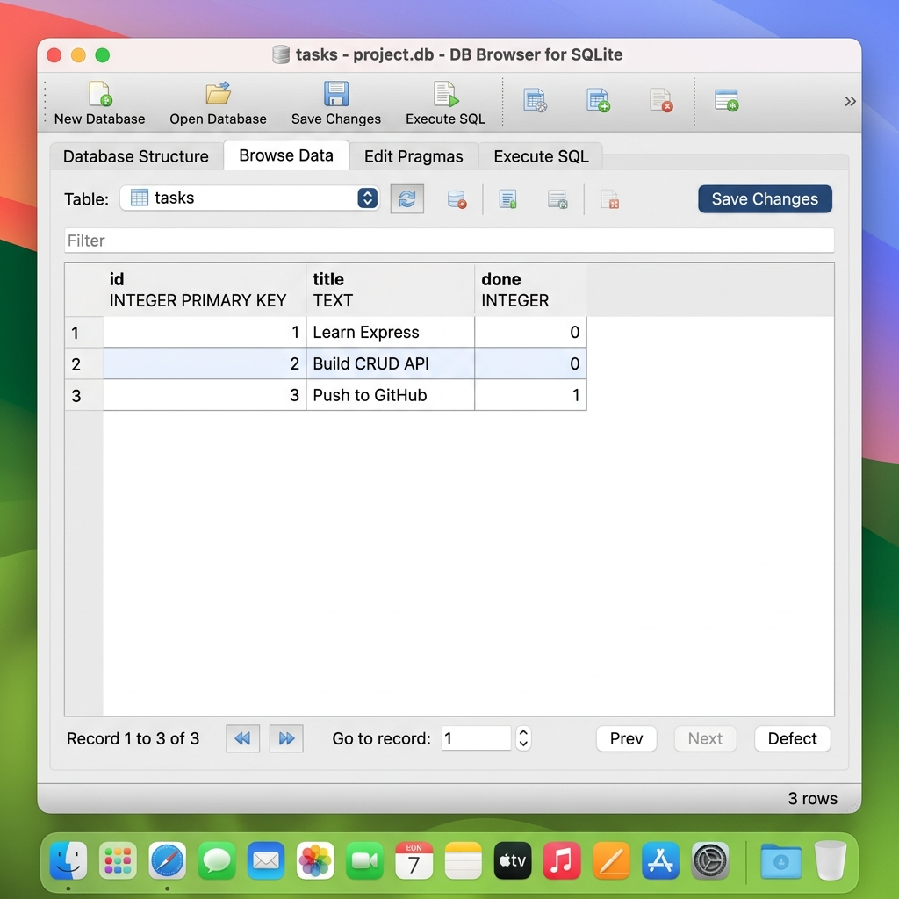

# Task Management API with SQLite

A modular RESTful API for managing tasks built with Node.js, Express, and SQLite.

## Why SQLite?
SQLite was chosen for this project because:
- **Zero Configuration**: It requires no external server setup, install, or administrative overhead.
- **Single File Persistence**: The entire database lives in a single file on disk, which makes it simple to manage and backup.
- **Restart Resilience**: Unlike in-memory arrays, our tasks are saved to disk, ensuring data survives when the server restarts.

## Database Location
The database is located at `database/tasks.db`. This file is git-ignored, meaning that every fresh clone of the project starts with a clean database.

On startup, the system automatically:
1. Creates the database file `database/tasks.db` if it is missing.
2. Creates the `tasks` table with schema:
   - `id`: INTEGER PRIMARY KEY AUTOINCREMENT
   - `title`: TEXT NOT NULL
   - `done`: INTEGER DEFAULT 0
3. Seeds the database with exactly three tasks if the table is empty (preventing duplicate seeds on subsequent restarts).

## DB Browser Screenshot
Below is the database table structure and seeded tasks viewed in DB Browser for SQLite:



## Example SQL Query (Stage 4)
During hand exploration, the following query was executed to fetch only completed tasks:

```sql
SELECT * FROM tasks WHERE done = 1;
```

**Returned Result:**
```json
[
  { "id": 3, "title": "Push to GitHub", "done": 1 }
]
```

---

## Project Structure
```text
database/
  database.js
controllers/
  taskController.js
routes/
  taskRoutes.js
middleware/
  errorHandler.js
swagger/
  openapi.json
server.js
package.json
README.md
.gitignore
```

## Installation
```bash
npm install
```

## Run the Server
```bash
npm start
```
The server runs on port `3000` by default. If port `3000` is busy, it automatically attempts the next available port.

## API Endpoints
- `GET /` → API information (version, DB type)
- `GET /health` → Health check
- `GET /tasks` → Get all tasks from SQLite
- `GET /tasks/:id` → Get a single task from SQLite
- `POST /tasks` → Create a new task in SQLite
- `PUT /tasks/:id` → Update a task in SQLite
- `DELETE /tasks/:id` → Delete a task from SQLite
- `GET /docs` → Swagger UI documentation

## Testing the API
You can run the API locally and query it using `curl` or Postman.

### Example: Create a task
```bash
curl -X POST http://localhost:3000/tasks \
  -H "Content-Type: application/json" \
  -d '{"title":"Buy Milk"}'
```

### Example: Get all tasks
```bash
curl http://localhost:3000/tasks
```
